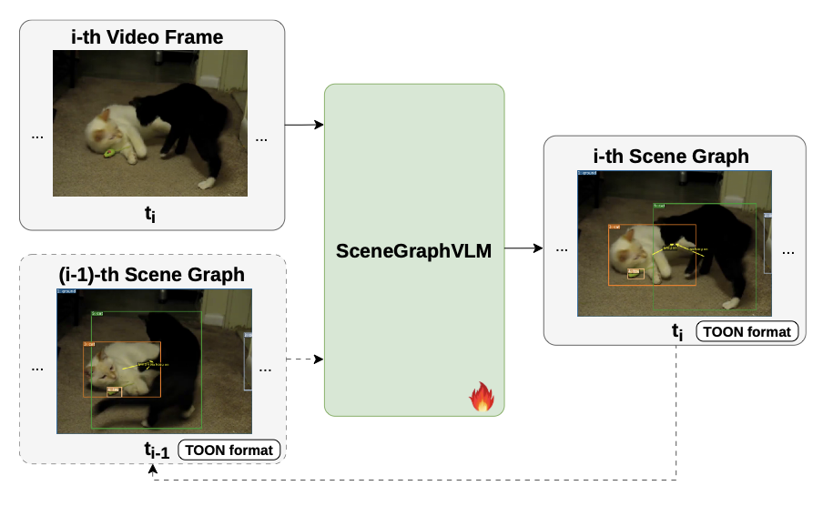
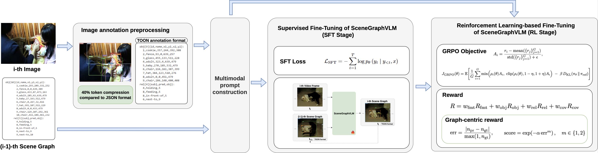

# IN PROCESS
---

# SceneGraphVLM: Dynamic Scene Graph Generation from Video with Vision-Language Models

Most existing methods for creating video scene graphs are based on **modular** solutions, where **inter-modular consistency** remains vulnerable. **SceneGraphVLM** is a compact **end-to-end** approach to scene graph generation from images and video based on a **vision–language model**. Instead of multi-stage detection pipelines and heavy post-processing, the model directly emits objects with bounding boxes, attributes, and relations in a **memory-efficient TOON** textual schema, improving structural validity and reducing parsing failures.

Training follows a **two-stage** recipe: **supervised fine-tuning** and subsequent **GRPO-driven reinforcement learning** with **graph-centric rewards** that measure semantic and spatial alignment at both **object** and **triplet** levels, complemented by a **format-consistency** reward to enforce schema compliance. **Extensive experiments** on **PSG** and **PVSG** demonstrate the **state-of-the-art** quality of the proposed model. For **practical deployment**, inference is optimized with **vLLM** and targets **sub-second** generation of complete scene graphs while preserving accuracy.

**Fig. 1.** A simplified diagram of the proposed vision-language model-driven SceneGraphVLM method for scene graph generation from video sequences with an **optional previous scene graph** as input. Scene graphs are represented in the **TOON** textual format.

**Fig. 2.** The learning scheme of the developed SceneGraphVLM method which employs a modern **two-stage** fine-tuning pipeline combining **SFT** and a **modified GRPO** objective with a **novel graph-centric reward** which takes into account the **predicate number** in the scene graph.

| Topic | Document |
|--------|-----------|
| **Overview (this page)** | `README.md` |
| **Metrics & evaluation** (OpenRouter, Swift/qwen-bench, Qwen judge, formulas, `metrics/results`) | [`metrics/metrics.md`](metrics/metrics.md) |
| **Visualization** (GT / pred videos, `field_gen_deploy`, demo assets) | [`visualization/vis.md`](visualization/vis.md) |
| **SFT training** (Swift scripts, datasets, checkpoints) | [`sft/SFT_README.md`](sft/SFT_README.md) |
| **Conda / Swift environment** | [`envs/SWIFT_README.md`](envs/SWIFT_README.md) |
| **PVSG data & exports** | [`datasets/annotations/PVSG_annot/PVSG_README.md`](datasets/annotations/PVSG_annot/PVSG_README.md) |
| **PSG data** | [`datasets/annotations/PSG_annot/PSG_README.md`](datasets/annotations/PSG_annot/PSG_README.md) |
| **Action Genome (AG)** | [`datasets/annotations/AG_annot/AG_README.md`](datasets/annotations/AG_annot/AG_README.md) |
| **BaseAnnot filter** (PVSG TOON subsampling + train/test overlap) | [`utils/BaseAnnot/BA.md`](utils/BaseAnnot/BA.md) |
| **PSFR key-frame selection** | [`utils/PSFR/PSFR.md`](utils/PSFR/PSFR.md) |
| **MaxInfo key-frame selection** | [`utils/MaxInfo/MI.md`](utils/MaxInfo/MI.md) |
| **Annotation cleaning** | [`utils/annotations_clean/CLEAN.md`](utils/annotations_clean/CLEAN.md) |
| **Classical SGG metrics (planned)** | `metrics/sgbench/` *(not implemented yet — see note in [`metrics/metrics.md`](metrics/metrics.md))* |
