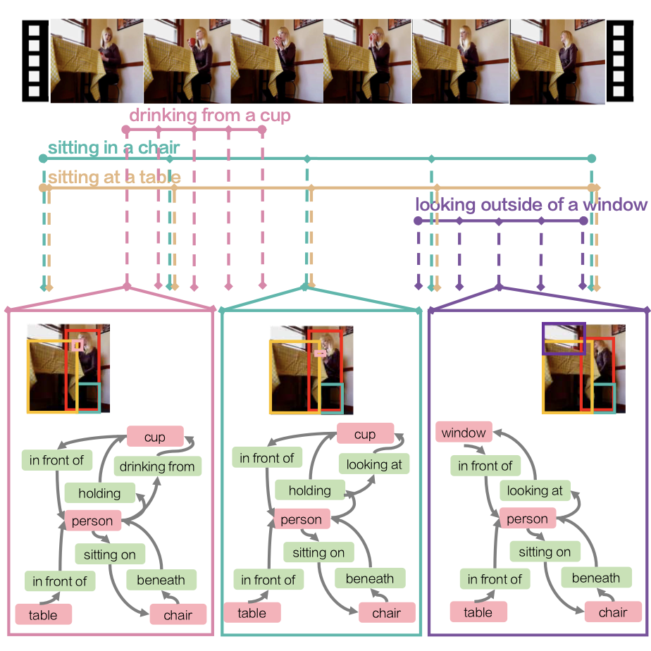

# Action Genome (AG) — SceneGraphVLM layout

This document describes the **Action Genome v1.0** workflow following the [official AG repository](https://github.com/JingweiJ/ActionGenome), with paths aligned to **SceneGraphVLM** under `datasets/annotations/AG_annot/`.

---

## Prerequisites

- **Python 3**
- **`ffmpeg`** on your `PATH` (frame extraction from video)
- Python packages used by the tools (`tqdm`, `Pillow`, etc.), consistent with the rest of the repo

For a ready-made environment (includes the above and Swift / Qwen tooling used elsewhere in the project), install via:

```bash
# from the SceneGraphVLM repository root
bash envs/sh_scripts/install_swift_qwen_3_5_sft.sh
```

Activate the created environment as described in that script’s output (e.g. `conda activate ...`).

---

## 1. Download videos and annotations

1. **Charades videos (480p)** — download from the [Charades / Prior](https://prior.allenai.org/projects/charades) page.

2. Place the video files under:

   ```text
   datasets/annotations/AG_annot/Charades/videos/
   ```

   Filenames must match what AG expects (e.g. `VIDEO_ID.mp4`), in agreement with `annotations/frame_list.txt`.

3. **Action Genome annotations** — download from the [official Google Drive](https://drive.google.com/drive/folders/1LGGPK_QgGbh9gH9SDFv_9LIhBliZbZys?usp=sharing).

4. Copy at least these files into:

   ```text
   datasets/annotations/AG_annot/annotations/
   ```

   - `object_bbox_and_relationship.pkl`
   - `person_bbox.pkl`
   - `frame_list.txt`
   - `object_classes.txt`
   - `relationship_classes.txt`

This repository may track small **`.txt`** files under `annotations/`. **`.pkl` files are not committed** — add them locally after download.

---

## 2. Dump frames from videos

The official release does not ship pre-extracted frames. After all 480p videos are under `Charades/videos/`, extract frames into `Charades/frames/`.

**Your shell’s current working directory must be `AG_annot`**, because `dump_frames.py` resolves paths **relative to `cwd`**.

```bash
cd /path/to/SceneGraphVLM/datasets/annotations/AG_annot
```

**Annotated frames only** (same sampling as in the AG paper; much smaller than full-video dumps — on the order of ~74 GB in the original release notes):

```bash
python tools/dump_frames.py
```

**All frames** from every video:

```bash
python tools/dump_frames.py --all_frames
```

**Explicit paths** (still relative to `cwd` = `AG_annot` unless you pass absolute paths). The snippet below matches the script defaults and is easy to copy and edit:

```bash
python tools/dump_frames.py \
  --video_dir Charades/videos \
  --frame_dir Charades/frames \
  --annotation_dir annotations
```

Default layout after dumping:

```text
Charades/frames/<VIDEO_ID>/<FRAME>.png
```

### How AG was labeled (from the paper)



> For every action, we uniformly sample **5 frames** across the action and annotate the person performing the action along with the objects they interact with. We also annotate the pairwise relationships between the person and those objects. Here, we show a video with **4 actions** labelled, resulting in **20 (= 4 × 5)** frames annotated with scene graphs. The objects are grounded back in the video as bounding boxes.

## 3. Official annotation file layout

`object_bbox_and_relationship.pkl` is a dictionary:

```text
{
  'VIDEO_ID/FRAME_ID': [
    {
      'class': 'book',
      'bbox': (x, y, w, h),
      'attention_relationship': ['looking_at'],
      'spatial_relationship': ['in_front_of'],
      'contacting_relationship': ['holding', 'touching'],
      'visible': True,
      'metadata': {
        'tag': 'VIDEO_ID/FRAME_ID',
        'set': 'train'
      }
    },
    ...
  ],
  ...
}
```

- **`visible`**: whether the interacted object is visible in the frame.

`person_bbox.pkl` stores per-frame person boxes (Faster R-CNN in the paper).

Other files under `annotations/`:

| File | Purpose |
|------|---------|
| `frame_list.txt` | All labeled frames |
| `object_classes.txt` | Object class names |
| `relationship_classes.txt` | Human–object relationship classes |

---

## 4. SceneGraphVLM tools (TOON + training JSONL)

Run these from the **repository root** (`SceneGraphVLM`). Paths such as `datasets/...` are **relative to the repo root** unless you pass absolute paths.

### 4.1 `prepare_original_ag_sft.py`

Reads AG pickles and **source frames** under `AG_annot/Charades/frames`, and writes:

- **Intermediate JSON** (TOON labels + metadata):  
  `datasets/annotations/AG_annot/data_sft_original/train_annotations_toon_sft.json`  
  `datasets/annotations/AG_annot/data_sft_original/test_annotations_toon_sft.json`
- **Resized images (640×480)** for training / eval:  
  `datasets/frames/AG_frames/train_images/...`  
  `datasets/frames/AG_frames/test_images/...`

Each sample’s `image_path` in JSON is **relative to the repo root** (POSIX `/`).

Example output roots (adjust to your machine):

- `…/SceneGraphVLM/datasets/frames/AG_frames/`
- Intermediate JSON stays under `AG_annot/data_sft_original/` (see the tree at the end).

```bash
cd /path/to/SceneGraphVLM

python datasets/annotations/AG_annot/tools/prepare_original_ag_sft.py
```

**Useful options:**

```bash
python datasets/annotations/AG_annot/tools/prepare_original_ag_sft.py \
  --repo_root /path/to/SceneGraphVLM \
  --ag_root datasets/annotations/AG_annot \
  --frames_root datasets/annotations/AG_annot/Charades/frames \
  --export_root datasets/annotations/AG_annot/data_sft_original \
  --images_out datasets/frames/AG_frames \
  --num_workers 32 \
  --limit 0
```

- `--keep_all` — do not restrict to `visible=True` only (default keeps visible-only).
- `--limit N` — process at most `N` frames (`0` = all).
- `--num_workers` — `1` = sequential; `>1` = multiprocessing pool.

### 4.2 `sft_to_jsonl_ag.py`

Reads the intermediate JSON from §4.1 and writes **Swift-style chat JSONL** (PVSG-like prompts with temporal context):

- `datasets/data_playground/AG_json/train.jsonl`
- `datasets/data_playground/AG_json/test.jsonl`

Example absolute path:  
`/data/homes/makarov_vd/workspace/SceneGraphVLM/datasets/data_playground/AG_json/`

```bash
cd /path/to/SceneGraphVLM

python datasets/annotations/AG_annot/tools/sft_to_jsonl_ag.py
```

**Path overrides:**

```bash
python datasets/annotations/AG_annot/tools/sft_to_jsonl_ag.py \
  --repo_root /path/to/SceneGraphVLM \
  --export_root datasets/annotations/AG_annot/data_sft_original \
  --out_dir datasets/data_playground/AG_json
```

### End-to-end pipeline (summary)

```bash
# 0) Download videos + pickles into AG_annot (see §1)

# 1) Dump frames (cwd = AG_annot)
cd datasets/annotations/AG_annot
python tools/dump_frames.py

# 2) TOON JSON + AG_frames (cwd = repo root)
cd /path/to/SceneGraphVLM
python datasets/annotations/AG_annot/tools/prepare_original_ag_sft.py --num_workers 32

# 3) JSONL for SFT / inference
python datasets/annotations/AG_annot/tools/sft_to_jsonl_ag.py

# 4) Optional: remove zero-relation rows → *_clean.jsonl (see §6)
python utils/annotations_clean/clean_zero_rel_frames.py datasets/data_playground/AG_json
```

## 5. Example scene graph (TOON)

After the pipeline above, labels follow a TOON-style layout. Example:

```text
      obj[4]{id,name,x1,y1,x2,y2}:
        1,person,20,3,329,353
        2,closet/cabinet,0,59,329,480
        3,broom,96,261,379,319
        4,doorway,311,0,640,480
      rel_pairs[3]{subj,attention,spatial,contacting,obj}:
        1,[not_looking_at],[behind],[not_contacting],2
        1,[not_looking_at],[in_front_of],[holding],3
        1,[not_looking_at],[in_front_of],[not_contacting],4
```

## 6. Optional: drop samples with zero relations

Some frames may have **no relations** in the assistant TOON block. To train on a subset where every kept row has at least one relation line under the detected relation header, use `utils/annotations_clean/clean_zero_rel_frames.py`.

### What the script does

- **Positional argument:** `input_root` — root directory to scan (relative to `cwd` or absolute).
- **Recursively** finds all `*.jsonl` under that root.
- **Skips** files whose stem already ends with `_clean` (so it will not re-process `train_clean.jsonl`).
- For each other `foo.jsonl`, writes **`foo_clean.jsonl`** in the **same directory** as the source.
- Writes a JSON report under `input_root` (default name below).

### Command (AG JSONL)

From the **repository root**:

```bash
cd /path/to/SceneGraphVLM

python utils/annotations_clean/clean_zero_rel_frames.py datasets/data_playground/AG_json
```

### Outputs (default AG paths)

- `datasets/data_playground/AG_json/train_clean.jsonl`
- `datasets/data_playground/AG_json/test_clean.jsonl`
- `datasets/data_playground/AG_json/zero_rel_cleanup_report.json` (or your `--report-name`)

The report includes per-file counts: total lines, removed as zero-relation, kept, invalid JSON, and lines where the expected relation header was missing.

> **Note:** The detector matches a **`rel[…]{subj,pred,obj}`**-style header. AG JSONL from `sft_to_jsonl_ag.py` uses **`rel_pairs[…]`** instead. Rows without a matching header are **passed through unchanged** (counted under `missing_rel_block` in the report). To filter zero-`rel_pairs` rows, extend `clean_zero_rel_frames.py` (or add a small adapter) to parse `rel_pairs[…]` the same way.

## 7. Directory tree (expected layout)

Repository root = `SceneGraphVLM`.

```text
SceneGraphVLM/
├── datasets/
│   ├── annotations/
│   │   └── AG_annot/
│   │       ├── AG_README.md
│   │       ├── figures/                 # AG.png — figure for (this README)
│   │       │   └── AG.png
│   │       ├── annotations/
│   │       │   ├── frame_list.txt
│   │       │   ├── object_classes.txt
│   │       │   ├── relationship_classes.txt
│   │       │   ├── object_bbox_and_relationship.pkl   # from official download
│   │       │   └── person_bbox.pkl                   # from official download
│   │       ├── Charades/              # user-prepared (not in git)
│   │       │   ├── videos/
│   │       │   └── frames/
│   │       ├── data_sft_original/     # prepare_original_ag_sft.py
│   │       │   ├── train_annotations_toon_sft.json
│   │       │   └── test_annotations_toon_sft.json
│   │       └── tools/
│   │           ├── dump_frames.py
│   │           ├── prepare_original_ag_sft.py
│   │           └── sft_to_jsonl_ag.py
│   ├── frames/
│   │   └── AG_frames/                 # prepare_original_ag_sft.py
│   │       ├── train_images/
│   │       └── test_images/
│   └── data_playground/
│       └── AG_json/                   # sft_to_jsonl_ag.py (+ optional clean step)
│           ├── train.jsonl
│           ├── test.jsonl
│           ├── train_clean.jsonl      # clean_zero_rel_frames.py
│           ├── test_clean.jsonl
│           └── zero_rel_cleanup_report.json
├── envs/
│   └── sh_scripts/
│       └── install_swift_qwen_3_5_sft.sh
└── utils/
    └── annotations_clean/
        └── clean_zero_rel_frames.py
```

---

## References

- Action Genome (CVPR 2020): [paper PDF](http://openaccess.thecvf.com/content_CVPR_2020/papers/Ji_Action_Genome_Actions_As_Compositions_of_Spatio-Temporal_Scene_Graphs_CVPR_2020_paper.pdf)
