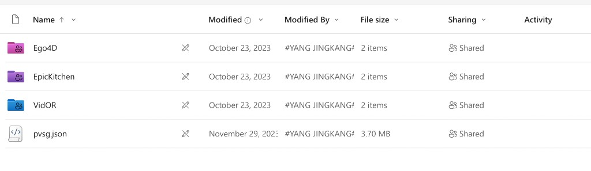

# Panoptic Video Scene Graph (PVSG)

<p align="center">
  <video controls width="720">
    <source src="figures/demo.mp4" type="video/mp4" />
    Your browser does not support the video tag.
  </video>
</p>

<p align="center">
  
</p>

This folder documents **PVSG** ([Panoptic Video Scene Graph Generation](https://arxiv.org/pdf/2311.17058)) and how we prepare **TOON** labels and **Swift-style JSONL** inside **SceneGraphVLM** under `datasets/annotations/PVSG_annot/`.

| Resource | Link |
|----------|------|
| **Paper (PVSG, CVPR 2023)** | [arXiv:2311.17058](https://arxiv.org/pdf/2311.17058) |
| **Project page** | [jingkang50.github.io/PVSG](https://jingkang50.github.io/PVSG/) |
| **Official code (OpenPVSG)** | [github.com/LilyDaytoy/OpenPVSG](https://github.com/LilyDaytoy/OpenPVSG.git) |
| **Dataset download** | [SharePoint — PVSGDataset](https://entuedu-my.sharepoint.com/:f:/g/personal/jingkang001_e_ntu_edu_sg/EpHpnXP-ta9Nu1wD6FwkDWAB0LxY8oE9VNqsgv6ln-i8QQ?e=fURefF) |
| **Quick view** | [SharePoint — QuickView](https://entuedu-my.sharepoint.com/:f:/g/personal/jingkang001_e_ntu_edu_sg/EgvpTfCTMudLpxw-h0_BVdcBAHacUaAQD-u9OvkUlpaDBg?e=LXnqaX) |

The upstream release describes **400** videos (~76.5 s on average at **5 FPS**): **VidOR** (289), **EpicKitchen** (55), **Ego4D** (56). In `pvsg.json`, splits are **338 train** and **62 validation**. This repo maps PVSG **`val`** to **`test_*`** filenames (same idea as the OpenPVSG layout).

## Prerequisites

- **Python 3**
- **`numpy`**, **`Pillow`**, **`tqdm`** (and any extras required by optional thinning: **PyTorch** / **transformers** / **OpenCV**, etc.)

Install the bundled Swift / Qwen environment (recommended):

```bash
# from the SceneGraphVLM repository root
bash envs/sh_scripts/install_swift_qwen_3_5_sft.sh
```

Activate the environment as printed by the installer.

## 1. Annotation JSON and unpacked media on disk

Place **`pvsg.json`** under:

```text
datasets/annotations/PVSG_annot/annotations/
  pvsg.json
```

Unzip the official archives from SharePoint (layout: **Ego4D**, **EpicKitchen**, **VidOR** plus `pvsg.json` at the share root). Follow the [OpenPVSG README](https://github.com/LilyDaytoy/OpenPVSG) (they recommend `unzip -j` to drop junk paths). 

<p align="center">
  
</p>

Point the preparation script at the unpacked RGB tree:

```text
datasets/annotations/PVSG_annot/OpenPVSG/
  ego4d/
    frames/
    masks/
    videos/
  epic_kitchen/
    frames/
    masks/
    videos/
  vidor/
    frames/
    masks/
    videos/
```

> Large binaries and `pvsg.json` are usually **git-ignored**; keep them on disk locally.

## 2. Build dense TOON

Run from the **repository root** (`SceneGraphVLM`).

- Reads `annotations/pvsg.json`.
- Loads RGB + masks from `OpenPVSG/{vidor,epic_kitchen,ego4d}/`.
- Resizes pixels to **640×480** and writes PNGs under `datasets/frames/PVSG_frames/{train_images,test_images}/`.
- Writes intermediate TOON JSON:

  `datasets/annotations/PVSG_annot/data_sft_original/train_annotations_toon_sft.json`  
  `datasets/annotations/PVSG_annot/data_sft_original/test_annotations_toon_sft.json`

```bash
cd /path/to/SceneGraphVLM

python datasets/annotations/PVSG_annot/tools/prepare_original_pvsg_sft.py
```

**Useful flags**

| Flag | Meaning |
|------|---------|
| `--repo_root` | SceneGraphVLM root (auto-detected if empty). |
| `--annotation` | Path to `pvsg.json` (default `datasets/annotations/PVSG_annot/annotations/pvsg.json`). |
| `--pvsg_data_root` | OpenPVSG root with per-source `frames/` and `masks/` (default `datasets/annotations/PVSG_annot/OpenPVSG`). |
| `--export_root` | Output dir for `*_annotations_toon_sft.json`. |
| `--images_out` | Root for PNGs (default `datasets/frames/PVSG_frames`). |
| `--sources` | Comma-separated sources (default `vidor,epic_kitchen,ego4d`). |
| `--splits` | Comma-separated splits (default `train,val`; `val` → `test_*.json`). |
| `--limit_videos` | Cap number of videos (`0` = all). |
| `--limit_frames` | Cap frames per video (`0` = all). |
| `--only_video` | Process a single video id. |
| `--num_workers` | Parallel workers (default: CPU count). |

## 3. Thin the TOON dataset (BaseAnnot, MaxInfo, PSFR)

PVSG is built from short clips sampled at fixed frame rate, but clips differ a lot in length and in how much each frame actually changes. Neighbouring frames are often almost identical, so treating every frame as an independent training example blows up the dataset with redundant pairs that share the same visual content and highly correlated scene graphs. That hurts VLM training: batches become dominated by near-duplicates, optimization is skewed, and the model gets less diverse supervision per real “scene change.” We therefore thin the TOON annotations (e.g. with BaseAnnot, MaxInfo, PSFR) to keep a smaller, less redundant set of frames while preserving useful variation, then export JSONL and optionally drop zero-relation rows so the supervision signal stays meaningful.

### 3.1 `utils/BaseAnnot/prepare_filtered_pvsg_sft.py`

**Defaults:** input `datasets/annotations/PVSG_annot/data_sft_original`, output `datasets/annotations/PVSG_annot/data_sft_base_annot`.

```bash
cd /path/to/SceneGraphVLM

python utils/BaseAnnot/prepare_filtered_pvsg_sft.py
```

**Output:** `train_annotations_toon_sft.json` and `test_annotations_toon_sft.json` under `--output_dir` (filtered rows).

### 3.2 `utils/MaxInfo/pvsg_maxinfo_filter.py`

**Defaults:** input `datasets/annotations/PVSG_annot/data_sft_original` (full dense TOON), output `datasets/annotations/PVSG_annot/data_sft_maxinfo`. GPU recommended.

```bash
python utils/MaxInfo/pvsg_maxinfo_filter.py --fp16
```

**Stacked example** (MaxInfo on BaseAnnot output instead of the full dataset):

```bash
python utils/MaxInfo/pvsg_maxinfo_filter.py --fp16 \
  --input_dir datasets/annotations/PVSG_annot/data_sft_base_annot \
  --output_dir datasets/annotations/PVSG_annot/data_sft_maxinfo
```

**Output:** filtered `train_annotations_toon_sft.json` / `test_annotations_toon_sft.json` under `--output_dir`. Tune e.g. `--tol`, `--r`, `--batch-size` (see the script docstring).

### 3.3 `utils/PSFR/pvsg_psfr_filter.py`

**Defaults:** input `datasets/annotations/PVSG_annot/data_sft_original`, output `datasets/annotations/PVSG_annot/data_sft_psfr`, config `utils/PSFR/config_pvsg.json`.

```bash
python utils/PSFR/pvsg_psfr_filter.py
```

**Output:** filtered `train_annotations_toon_sft.json` / `test_annotations_toon_sft.json` under `--output_dir`.

## 4. Export Swift JSONL (`sft_to_jsonl_pvsg.py`)

Run from the **repository root**. Point `--input_dir` at the TOON directory you produced after **Section 2** and optional **Section 3** (e.g. `data_sft_maxinfo` after MaxInfo on the full export, or `data_sft_base_annot` / `data_sft_psfr` if you use only one of those filters).

The **first** frame of each video uses **`PROMPT_NO_PREV`**; **every later frame** uses **`PROMPT_WITH_PREV`**, with the previous frame’s `answer_toon` string substituted for `<<PREV_TOON>>` (full text in **Section 5**).

Default output directory:

- `datasets/data_playground/PVSG_json/pvsg_all_data_gt_prompt/train.jsonl`
- `datasets/data_playground/PVSG_json/pvsg_all_data_gt_prompt/test.jsonl`

```bash
cd /path/to/SceneGraphVLM

python datasets/annotations/PVSG_annot/tools/sft_to_jsonl_pvsg.py \
  --input_dir datasets/annotations/PVSG_annot/data_sft_maxinfo
```

**Path overrides:**

```bash
python datasets/annotations/PVSG_annot/tools/sft_to_jsonl_pvsg.py \
  --repo_root /path/to/SceneGraphVLM \
  --input_dir datasets/annotations/PVSG_annot/data_sft_maxinfo \
  --output_dir datasets/data_playground/PVSG_json/pvsg_all_data_gt_prompt
```

**Merge multiple TOON roots** (same filenames in each folder):

```bash
python datasets/annotations/PVSG_annot/tools/sft_to_jsonl_pvsg.py \
  --input_dir datasets/annotations/PVSG_annot/data_sft_base_annot \
  --input_dir datasets/annotations/PVSG_annot/data_sft_maxinfo \
  --output_dir datasets/data_playground/PVSG_json/my_merged_run
```

**Replace prompts only** in an existing JSONL:

```bash
python datasets/annotations/PVSG_annot/tools/sft_to_jsonl_pvsg.py \
  --replace-prompt-only \
  --input path/to/in.jsonl \
  --output path/to/out.jsonl
```

## 5. User prompts (full templates + expanded subsequent-frame example)

### 5.1 First frame of each video

```text
<image>
Generate a structured scene graph for an image of size (640 x 480) using the following text format.

Output Format:

<answer>
obj[N]{id,name,x1,y1,x2,y2}:
  id,name,x1,y1,x2,y2
  ...
rel[M]{subj,pred,obj}:
  subj,pred,obj
  ...
</answer>

Guidelines:
- Objects:
  - Use integer IDs starting from 1 in the id field (e.g., 1, 2, 3).
  - The name must be the object category name (e.g., person, umbrella).
  - Provide the bounding box [x1, y1, x2, y2] in integer pixel format.
  - Include all visible objects, even if they have no relationships.

- Relationships:
  - Represent interactions using integer object IDs in subj and obj.
  - pred is the relationship type (string), such as in-front-of, attached-to, beside.
  - Omit relationships for objects that do not participate in any interaction.

Example output:

<answer>
obj[7]{id,name,x1,y1,x2,y2}:
  1,person,281,272,524,438
  2,umbrella,273,123,640,434
  3,house,0,88,262,426
  4,window-other,163,262,195,294
  5,tree-merged,0,0,640,440
  6,sky-other-merged,0,0,459,123
  7,building-other-merged,537,164,640,291
rel[5]{subj,pred,obj}:
  1,in-front-of,5
  3,attached-to,4
  4,hanging-from,3
  5,beside,3
  6,over,5
</answer>

Now, generate the complete scene graph for the provided image. Write your response only between <answer> and </answer> tags.
```

### 5.2 Subsequent frames

```text
<image>
Generate a structured scene graph for an image of size (640 x 480) using the following text format.

Output Format:

<answer>
obj[N]{id,name,x1,y1,x2,y2}:
  id,name,x1,y1,x2,y2
  ...
rel[M]{subj,pred,obj}:
  subj,pred,obj
  ...
</answer>

Guidelines:
- Objects:
  - Use integer IDs starting from 1 in the id field (e.g., 1, 2, 3).
  - The name must be the object category name (e.g., person, umbrella).
  - Provide the bounding box [x1, y1, x2, y2] in integer pixel format.
  - Include all visible objects, even if they have no relationships.

- Relationships:
  - Represent interactions using integer object IDs in subj and obj.
  - pred is the relationship type (string), such as in-front-of, attached-to, beside.
  - Omit relationships for objects that do not participate in any interaction.

Example output:

<answer>
obj[7]{id,name,x1,y1,x2,y2}:
  1,person,281,272,524,438
  2,umbrella,273,123,640,434
  3,house,0,88,262,426
  4,window-other,163,262,195,294
  5,tree-merged,0,0,640,440
  6,sky-other-merged,0,0,459,123
  7,building-other-merged,537,164,640,291
rel[5]{subj,pred,obj}:
  1,in-front-of,5
  3,attached-to,4
  4,hanging-from,3
  5,beside,3
  6,over,5
</answer>

You are also given the previous frame's ground-truth scene graph in TOON format.
Use it as temporal context, but rely primarily on the current image.
Important:
- Include all objects visible in the CURRENT image, even if they did not exist in the previous graph.
- Do NOT include objects that are NOT visible in the current image, even if they exist in the previous graph.
- Output ONLY the complete scene graph for the CURRENT image, using the TOON structure from the Output Format above, inside one <answer>...</answer> block.

Previous frame scene graph (TOON):

obj[7]{id,name,x1,y1,x2,y2}:
  1,person,284,275,511,439
  2,umbrella,234,133,640,411
  3,house,0,88,235,423
  4,window-other,111,245,178,294
  5,tree-merged,0,0,640,450
  6,sky-other-merged,0,0,451,121
  7,building-other-merged,511,178,640,222
rel[5]{subj,pred,obj}:
  1,in-front-of,5
  3,attached-to,4
  4,hanging-from,3
  5,beside,3

Now, generate the complete scene graph for the provided image. Write your response only between <answer> and </answer> tags.
```

## 5. Drop samples with zero relations (`clean_zero_rel_frames.py`) — **after Section 4 only**

Same utility as for other datasets: `utils/annotations_clean/clean_zero_rel_frames.py`. It **only** reads **`*.jsonl`** trees; run it **after** `sft_to_jsonl_pvsg.py` has written `train.jsonl` / `test.jsonl`, and **after** you have finished the **Section 3** thinning that feeds your chosen `--input_dir` for that export.

**PVSG JSONL uses `rel[N]{subj,pred,obj}`**, so the detector in the script **matches** this format and can remove rows with zero declared / zero actual relation lines.

### What the script does

- **Positional argument:** `input_root` — root directory to scan (relative to `cwd` or absolute).
- **Recursively** finds all `*.jsonl` under that root.
- **Skips** files whose stem already ends with `_clean` (so it will not re-process `train_clean.jsonl`).
- For each other `foo.jsonl`, writes **`foo_clean.jsonl`** in the **same directory** as the source.
- Writes a JSON report under `input_root` (default name below).

### Command (PVSG JSONL)

From the **repository root**:

```bash
cd /path/to/SceneGraphVLM

python utils/annotations_clean/clean_zero_rel_frames.py datasets/data_playground/PVSG_json/pvsg_all_data_gt_prompt
```

Optional report name:

```bash
python utils/annotations_clean/clean_zero_rel_frames.py \
  datasets/data_playground/PVSG_json/pvsg_all_data_gt_prompt \
  --report-name pvsg_zero_rel_cleanup_report.json
```

### Outputs (default paths)

- `datasets/data_playground/PVSG_json/pvsg_all_data_gt_prompt/train_clean.jsonl`
- `datasets/data_playground/PVSG_json/pvsg_all_data_gt_prompt/test_clean.jsonl`
- `datasets/data_playground/PVSG_json/pvsg_all_data_gt_prompt/zero_rel_cleanup_report.json` (or custom `--report-name`)

The report includes per-file counts: total lines, removed as zero-relation, kept, invalid JSON, and lines where the expected relation header was missing.

## 6. End-to-end pipeline (summary)

```bash
cd /path/to/SceneGraphVLM

# 1) Full TOON + 640x480 frames
python datasets/annotations/PVSG_annot/tools/prepare_original_pvsg_sft.py

# 2) Thin TOON (optional — pick what you need; see Section 3)
#    BaseAnnot: original → base_annot
python utils/BaseAnnot/prepare_filtered_pvsg_sft.py
#    MaxInfo on FULL dense TOON (script defaults: input = data_sft_original)
python utils/MaxInfo/pvsg_maxinfo_filter.py --fp16
#    If you need MaxInfo on BaseAnnot output instead, run again, e.g.:
#    python utils/MaxInfo/pvsg_maxinfo_filter.py --fp16 \
#      --input_dir datasets/annotations/PVSG_annot/data_sft_base_annot \
#      --output_dir datasets/annotations/PVSG_annot/data_sft_maxinfo
#    PSFR: original → psfr (independent branch)
python utils/PSFR/pvsg_psfr_filter.py

# 3) JSONL from the TOON root you train on (example: MaxInfo output)
python datasets/annotations/PVSG_annot/tools/sft_to_jsonl_pvsg.py \
  --input_dir datasets/annotations/PVSG_annot/data_sft_maxinfo \
  --output_dir datasets/data_playground/PVSG_json/pvsg_all_data_gt_prompt

# 4) Clean JSONL — always last (requires train.jsonl / test.jsonl from step 3)
python utils/annotations_clean/clean_zero_rel_frames.py datasets/data_playground/PVSG_json/pvsg_all_data_gt_prompt
```

## 7. Directory tree (expected layout)

```text
SceneGraphVLM/
├── datasets/
│   ├── annotations/
│   │   └── PVSG_annot/
│   │       ├── PVSG_README.md
│   │       ├── figures/                 # demo.mp4, teaser.png, sharepoint_download_layout.png (this README)
│   │       ├── annotations/             # pvsg.json (often local only)
│   │       ├── OpenPVSG/                # ego4d | epic_kitchen | vidor (frames, masks, videos)
│   │       ├── data_sft_original/       # prepare_original_pvsg_sft.py
│   │       │   ├── train_annotations_toon_sft.json
│   │       │   └── test_annotations_toon_sft.json
│   │       ├── data_sft_base_annot/     # optional: BaseAnnot (Section 3)
│   │       ├── data_sft_maxinfo/        # optional: MaxInfo (Section 3); default input = data_sft_original
│   │       ├── data_sft_psfr/           # optional: PSFR (Section 3)
│   │       └── tools/
│   │           ├── prepare_original_pvsg_sft.py
│   │           └── sft_to_jsonl_pvsg.py
│   ├── frames/
│   │   └── PVSG_frames/
│   │       ├── train_images/
│   │       └── test_images/
│   └── data_playground/
│       └── PVSG_json/
│           └── pvsg_all_data_gt_prompt/    # example sft_to_jsonl_pvsg.py output (Section 4)
│               ├── train.jsonl
│               ├── test.jsonl
│               ├── train_clean.jsonl       # clean_zero_rel_frames.py (Section 6)
│               ├── test_clean.jsonl
│               └── zero_rel_cleanup_report.json
├── envs/
│   └── sh_scripts/
│       └── install_swift_qwen_3_5_sft.sh
└── utils/
    ├── BaseAnnot/
    │   └── prepare_filtered_pvsg_sft.py
    ├── MaxInfo/
    │   └── pvsg_maxinfo_filter.py
    ├── PSFR/
    │   ├── pvsg_psfr_filter.py
    │   └── config_pvsg.json
    └── annotations_clean/
        └── clean_zero_rel_frames.py
```

## References

- **PVSG (CVPR 2023):** [arXiv:2311.17058](https://arxiv.org/pdf/2311.17058) · [Project page](https://jingkang50.github.io/PVSG/) · [OpenPVSG (GitHub)](https://github.com/LilyDaytoy/OpenPVSG.git)
- **Dataset (SharePoint):** [PVSGDataset](https://entuedu-my.sharepoint.com/:f:/g/personal/jingkang001_e_ntu_edu_sg/EpHpnXP-ta9Nu1wD6FwkDWAB0LxY8oE9VNqsgv6ln-i8QQ?e=fURefF) · [QuickView](https://entuedu-my.sharepoint.com/:f:/g/personal/jingkang001_e_ntu_edu_sg/EgvpTfCTMudLpxw-h0_BVdcBAHacUaAQD-u9OvkUlpaDBg?e=LXnqaX)
